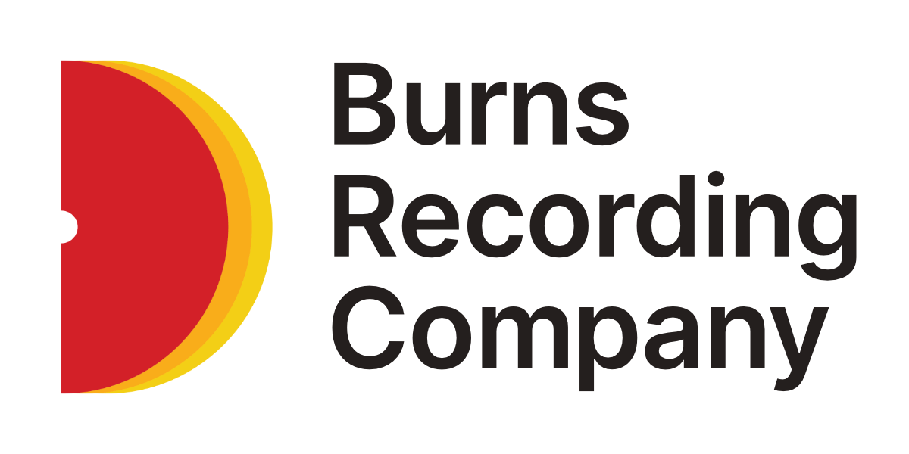

# l-plx

Player data encoding methods and values.

## Setup

Install dependencies and build. See `package.json` scripts.

### Building

Build the library. The output code will appear in the `dist` folder. It should work on the web in browsers, and on Node without changes or further configuration.

### Testing

Test the code. Run this if you make any changes to ensure your changes will respect the existing functionality. These tests will need updated if you want to keep your work consistent if you happen to change the return types or parameter shapes.

## Usage

### Encoding

#### `encode`

This function encodes and encrypts a byte array or stream of audio data. It takes two arguments:

* data: a Uint8Array or ReadableStream containing the audio data
* options: an object containing the following properties:
  * secretKey: a Uint8Array or string representing the secret key used to encrypt the data
  * iv: a Uint8Array or string representing the initialization vector used to encrypt the data

The function returns a Promise that resolves to a Uint8Array or ReadableStream containing the encrypted audio data.

#### `encodeFromString`

This function encodes and encrypts a string of audio data. It takes two arguments:

* data: a string containing the audio data
* options: an object containing the following properties:
  * secretKey: a Uint8Array or string representing the secret key used to encrypt the data
  * iv: a Uint8Array or string representing the initialization vector used to encrypt the data

The function returns a Promise that resolves to a Uint8Array or ReadableStream containing the encrypted audio data.

### Decoding

#### `decode`

This function decodes and decrypts a byte array of encoded audio data. It takes two arguments:

* data: a Uint8Array or ReadableStream containing the encoded audio data
* options: an object containing the following properties:
  * secretKey: a Uint8Array or string representing the secret key used to decrypt the data
* iv: a Uint8Array or string representing the initialization vector used to * decrypt the data

The function returns a Promise that resolves to a Uint8Array or ReadableStream containing the decrypted audio data.

#### `decodeFromString`

The decodeFromString function is used to decode and decrypt an audio file that is represented as a string of encrypted data. It takes two arguments:

* encryptedData: a string containing the encrypted audio data
* options: an object containing the following properties:
  * secretKey: a string representing the secret key used to decrypt the data
  * iv: a string representing the initialization vector used to decrypt the data
  * encoding: a string representing the encoding of the encrypted data (e.g. 'base64')

The function returns a Promise that resolves to a Uint8Array containing the decrypted audio data. This data can then be used to create an audio Blob and played using an HTMLAudioElement.

#### `decodeToString`

This function decodes and decrypts an encoded byte array of audio data and returns the decrypted data as a string. It takes two arguments:

* data: a Uint8Array containing the encoded audio data
* options: an object containing the following properties:
  * secretKey: a Uint8Array or string representing the secret key used to decrypt the data
  * iv: a Uint8Array or string representing the initialization vector used to decrypt the data

The function returns a Promise that resolves to a string containing the decrypted audio data.

### Example

```ts
import { decodeFromString } from './decodeFromString';

const audioElement = document.getElementById('audio') as HTMLAudioElement;

async function playDecryptedAudio(encryptedData: string, options: EncoderOptions) {
  const decryptedData = await decodeFromString(encryptedData, options);

  const audioBlob = new Blob([decryptedData], { type: 'audio/mpeg' });
  const audioUrl = URL.createObjectURL(audioBlob);

  audioElement.src = audioUrl;
  audioElement.play();
}

const encryptedData = 'eW91bGxmaW5kd2hhdGV2ZXJ5b3Vnb2xvb2tpbmdmb3I...';
const options = {
  secretKey: '...',
  iv: '...',
  encoding: 'base64',
};

playDecryptedAudio(encryptedData, options);
```

---
This software is provided as-is. Do not use this for security-critical applications.

&copy; 2022 Burns Recording Company
